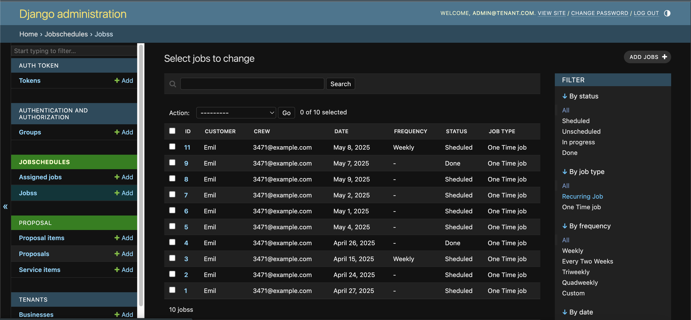
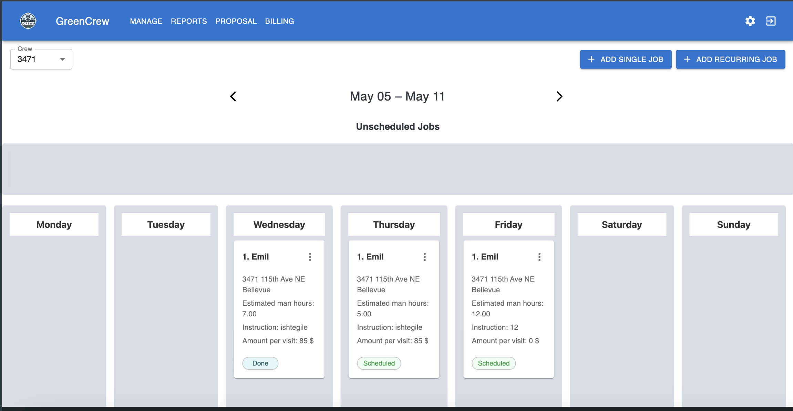
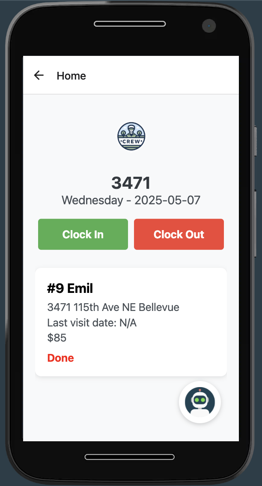

# 🌿 LandscapeCrewSystem

A full-stack **Multi-Tenant Crew Management System** designed for landscaping businesses.

## 📱 Platforms

- **CrewAppServer** – Django REST API backend with multi-tenant support.
- **CrewAppWeb** – React.js web portal for business managers.
- **CrewAppMobile** – React Native mobile app for field crew members.

---

## 🚀 Features

### ✅ Admin Panel (Django)
- Multi-tenant tenant/domain management
- CRUD for crews, customers, jobs, and proposals

### 🌐 Web App (React + Redux)
- Dashboard for business managers
- Kanban-style job scheduling (Vertical/Horizontal)
- Proposal generation, crew management
- Secure login, protected routes

### 📱 Mobile App (React Native + Expo)
- Crew job assignments
- Checklist-based job execution
- Time tracking, location-aware chat assistant
- Offline-friendly UI/UX

---

## 🛠️ Tech Stack

| Layer         | Stack/Libraries                                                                 |
|---------------|----------------------------------------------------------------------------------|
| **Backend**   | Django 4.2, Django REST Framework, django-tenants, PostgreSQL, Email Templates |
| **Frontend**  | React.js, Redux Toolkit, MUI, CoreUI, React Router, SCSS                        |
| **Mobile**    | React Native (Expo), react-navigation, axios, dotenv, location API              |
| **AI Chatbot**| LangChain, OpenAI API, location context awareness                              |
| **Database**  | PostgreSQL with schema-based multi-tenancy                                      |
| **Dev Tools** | Webpack, ESLint, Babel, Git

---

## 📸 Screenshots

| View | Screenshot |
|------|------------|
| **Django Admin Panel (`CrewAppServer`)** |  |
| **Main Scheduling Page (`CrewAppWeb`)** |  |
| **Crew Home Screen (`CrewAppMobile`)** |  |

---

## 🚀 HOW TO RUN

### Backend – `CrewAppServer`

```bash
# Setup virtual environment
python3 -m venv venv
source venv/bin/activate

# Install dependencies
pip install -r requirements.txt

# Migrate DB
cd CrewAppServer
python manage.py makemigrations
python manage.py migrate

# Run server
python manage.py runserver 0.0.0.0:8000
```

### Frontend – `CrewAppWeb`

```bash
cd CrewAppWeb

# Install dependencies
npm install

# Start development server
npm start
```

### Mobile – `CrewAppMobile`
```bash
# Set your backend URL
# In .env file, add:
# BACKEND_URL=http://<your-ip>:8000

# Install dependencies
npm install

# Clean and start Expo
npx expo start -c
```